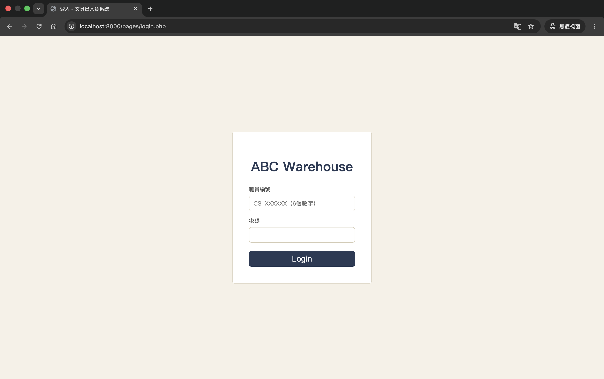
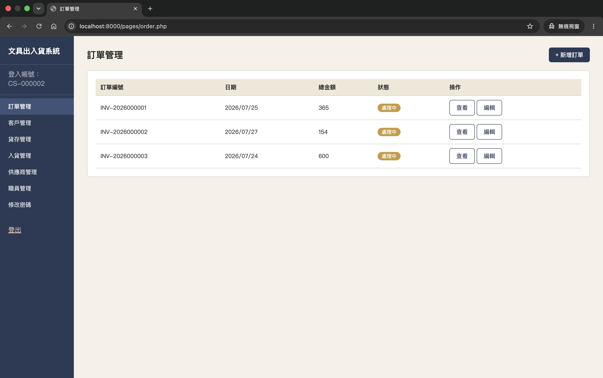
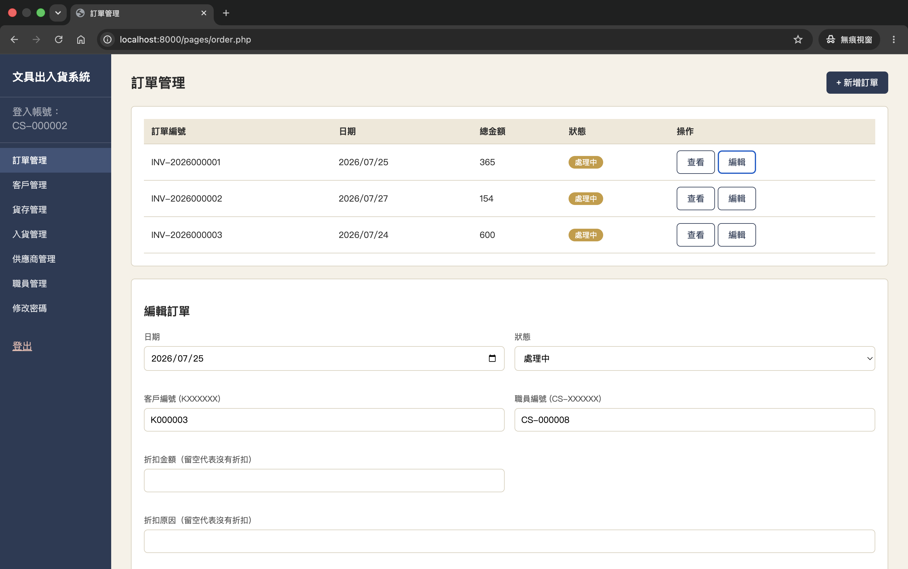
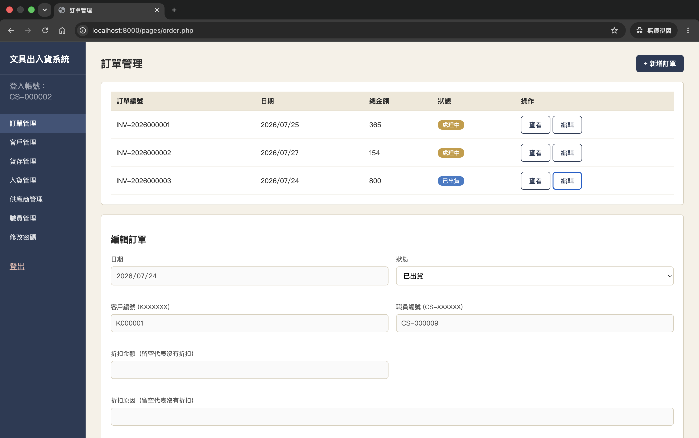

# 大綱

本專案重點在於練習資料庫正規化設計、RESTful API 的權限控管，以及交易安全性的實作。\
我主要負責後端處理，其中包括資料庫 schema 設計、API、權限控管跟交易規則的實作；前端的部分我用 AI 工具協助產生初版程式碼，再進行測試、抓 bug 及調整，以符合後端的設計。

## 使用的程式及工具

資料庫：MySQL\
後端：Flask（語言 Python）\
前端：PHP\
其他工具：Docker

## 快速開始

執行之前請確認電腦裡已安裝：
- Docker Desktop（並啟動）
- Python 3.x（用於執行 init_db.py）
- （選用）MySQL 用戶端工具，如 MySQL Workbench，方便直接查看資料庫內容

1. 複製 `.env.example` 為 `.env`，並自行更改密碼的部份（測試用，密碼可自訂）
2. 在終端機執行 `docker compose up --build` 
3. python init_db.py（清空所有 table 的資料，再重新匯入測試資料進 MySQL） 
4. 瀏覽器打開 [http://localhost:8000/pages/login.php](http://localhost:8000/pages/login.php)
5. 測試帳號一：CS-000001 / test123（一般職員）
測試帳號二：CS-000002 / test123（管理員）

## 技術重點

- 角色權限控管：分開 admin / staff 兩種角色，API 與前端皆有對應的存取限制
- 交易編輯的資料一致性：更新訂單/入貨明細時，正確處理庫存回補與重新扣減，避免重複計算
- Transaction 安全設計：庫存扣減、單號流水號產生（Sequences 表）皆使用 `for update` 鎖定
- 前後端分離架構

# 功能

本專題的主旨是虛構一間文具批發公司，需要以下功能：

1. 職員資料紀錄：記錄了所有職員的基本資料，其中包括職員編號、職員名字、所屬部門、聯絡電話（非必要）、是否在職
    1. 功能限制：只有管理員可以 select, insert, update
    2. 職員編號格式為 “CS-XXXXXX”
2. 登入功能：權限分為管理員（admin）跟普通人員（staff），普通人員只可以看到自己負責的訂單
    1. 只有職員為在職的時候才可以使用登入系統
    2. 清潔人員不會擁有登入的帳號
3. 客戶資料紀錄：記錄客戶的基本資料，其中包括客戶編號、公司名字、聯絡人名字、聯絡電話、負責職員的編號
    1. 功能限制：管理員可以 select, insert, update 所有客戶資料；普通人員只可以 select, update 自己客戶的資料（不包括職員編號），insert 不受影響
4. 供應商資料紀錄：記錄供應商的基本資料，其中包括供應商編號、公司名字、聯絡人名字、聯絡電話
    1. 功能限制：管理員可以 select, insert, update 所有客戶資料；普通人員只可以 select，insert
5. 貨存紀錄：記錄所有貨品的資料，其中包括貨品編號、名字、現有數量、貨品定價、供應商是誰、是否停止入貨
    1. 功能限制：管理員可以 select, insert, update 但 insert, update 不可修改現有數量；普通人員只可以 select
    2. 如果有貨品很少客戶訂購，管理員可以決定停止再跟供應商購入這個貨品，即是入貨記錄不能再有它
6. 入貨紀錄：記錄所有入貨的資料，包括入貨單編號、入貨日期、總金額、折扣（供應商提供）、折扣原因、決定下單職員的編號（因為一張單可以有多個相關貨品，所以另外有一個入貨單明細，記錄了入貨單編號、相關的的貨品、單價、購入數量、總計）
    1. 功能限制：管理員可以 select, insert, update 所有資料；普通人員只可以 select, update 自己下單的資料（不包括職員編號），insert 不受影響
    2. 入貨單編號格式為 “P-YEARXXXXXX”
    3. 訂單折扣跟折扣原因要嘛一起有要嘛一起沒有
7. 訂單紀錄：記錄所有客戶訂講文具的資料，包括訂單編號、訂單日期、折扣原因、折扣、訂單總金額、訂購的客戶編號、負責的職員編號，訂單狀態（因為一張單可以有多個相關貨品，所以另外有一個訂單明細，記錄了訂單編號、相關的的貨品、單價、訂購數量、總計）
    1. 功能限制：管理員可以 select, insert, update 所有訂單；普通人員只可以 select, update 自己負責的訂單（不包括職員編號），insert 不受影響
    2. 訂單編號格式為 “INV-YEARXXXXXX”
    3. 訂單折扣跟折扣原因要嘛一起有要嘛一起沒有
    4. 訂單狀態只可以是：處理中、已出貨、已完成、已取消
    5. 透過 “總計 = 單價 * 訂購數量”，而不是直接輸入
    6. 其他限制：只有狀態為處理中的訂單可以被取消，而且取消的人只可以是負責該訂單的職員跟管理員；狀態為已出貨中的訂單，只能修改狀態，不可修改其他資料；已完成、已取消的訂單則完全不可修改

## 注意的項目：

1. 所有有編號的表格都應該需要兩個 attributes “id” & “XXX_no”，一個是用 AUTO_INCREMENT 作為 PK，另一個是給定格式，方便對外使用及查詢
2. 為了避免訂單編號無限變大，需要 sequences ( name, year, last_id )，記錄前一年最後一個號碼到哪，每一年的單號就可以由頭重來

# 專案截圖
## 登入頁面

## 訂單管理

# 已知限制與未來方向
- 促銷邏輯尚未實作：目前只採用單一價錢
- 訂單與客戶的地址欄位暫未納入